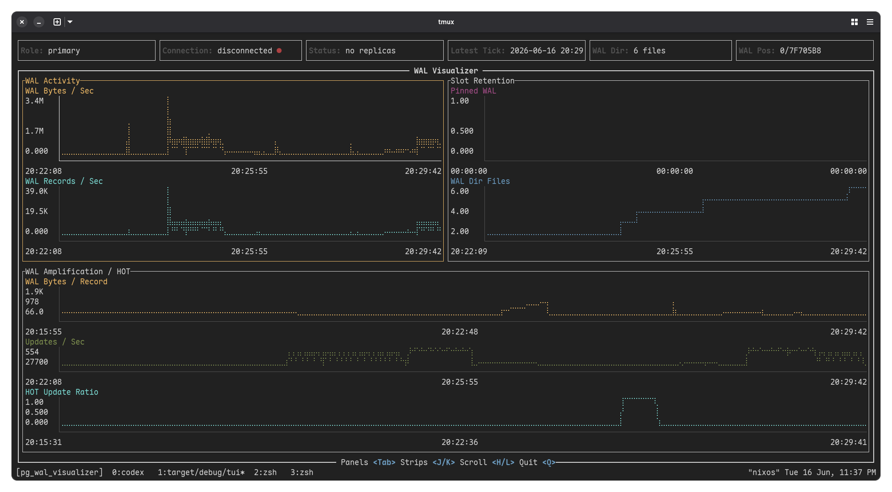

# WALObserver

WALObserver is a local Postgres WAL observability project.

I built it to:

- learn how to build a real TUI in Rust with `ratatui`
- get a better feel for what Postgres WAL is telling you during load, retention problems, and replay behavior



### What It Tries To Answer

These are the kinds of questions WALObserver is meant to help with.

### 1. Standby restartpoint pressure during WAL spikes

Primary WAL generation spikes hard during a burst of load. On the standby, `restartpoints_req` starts climbing because recovery is under pressure and WAL is approaching `max_wal_size` faster than restartpoints can comfortably keep up.

Read: standby recovery pressure is rising, and bursty replay is pushing WAL headroom too hard.

### 2. Stale replication slot retaining old WAL

Write traffic on the primary is normal, but `pg_wal` keeps growing anyway. Checkpoints are happening, current WAL generation rate is not extreme, yet old segments are not being recycled. Looking at `pg_replication_slots`, one slot has a `restart_lsn` far behind current WAL.

Read: a lagging or inactive replication slot is retaining old WAL.

### 3. Non-HOT updates causing WAL amplification on the primary

The primary is doing many updates, and WAL per second is much higher than expected for the observed row volume. `wal_bytes` rises hard, but `wal_records` does not grow nearly as sharply, which means the average WAL cost per record is increasing. At the same time, table stats show many updates but very few HOT updates.

Read: non-HOT update churn is increasing WAL cost through extra index work.

### What The TUI Shows

The TUI is organized around those reads:

- `WAL Activity`
  - `WAL Bytes / Sec`
  - `WAL Records / Sec`
- `Slot Retention`
  - `Pinned WAL [...]`
  - `WAL Dir Files`
- `WAL Amplification / HOT`
  - `WAL Bytes / Record`
  - `Updates / Sec`
  - `HOT Update Ratio`
- standby-only replay strips when the instance is in recovery

The TUI live-refreshes. It keeps polling connection state and rereading tick data so the charts stay current during demos.

### Stack

- Rust stable
- `ratatui` for the TUI
- `sqlx` for Postgres access
- PostgreSQL 16 running locally from the repo
- Nix flake dev shell
- `just` recipes for common commands

### Bootstrapping

```bash
nix develop path:. -c zsh
just db-init
```

The dev shell exports:

- `PGDATA=$PWD/.local/postgres`
- `PGHOST=$PWD/.local/postgres`
- `PGPORT=5433`
- `PGUSER=postgres`
- `PGDATABASE=walobserver`
- `DATABASE_URL=postgresql://postgres@127.0.0.1:5433/walobserver`

### Running It

Start Postgres and initialize the local schema:

```bash
just db-init
just db-start
```

Run the collector:

```bash
cargo run --bin collector
```

In another shell, open the TUI:

```bash
cargo run --bin tui
```

### Database Lifecycle

```bash
just db-start
just db-stop
just db-reset
just db-shell
```

### Demo Load Presets

This was mainly generated by codex, didn't pay enough attention to it, but it seems to be working.

Generic load:

```bash
just load
just load mixed 5 20
```

Scenario presets:

```bash
just load-hot
just load-non-hot
just load-burst
```

You can also drive it directly:

```bash
just load hot 8 80
just load non_hot 8 80
just load burst 2 200
```

What they do:

- `hot`
  - updates a HOT-friendly table
  - should keep `HOT Update Ratio` high
- `non_hot`
  - updates indexed mutable columns
  - should drive `HOT Update Ratio` down and make WAL amplification easier to see
- `burst`
  - creates sharper WAL spikes for activity screenshots
